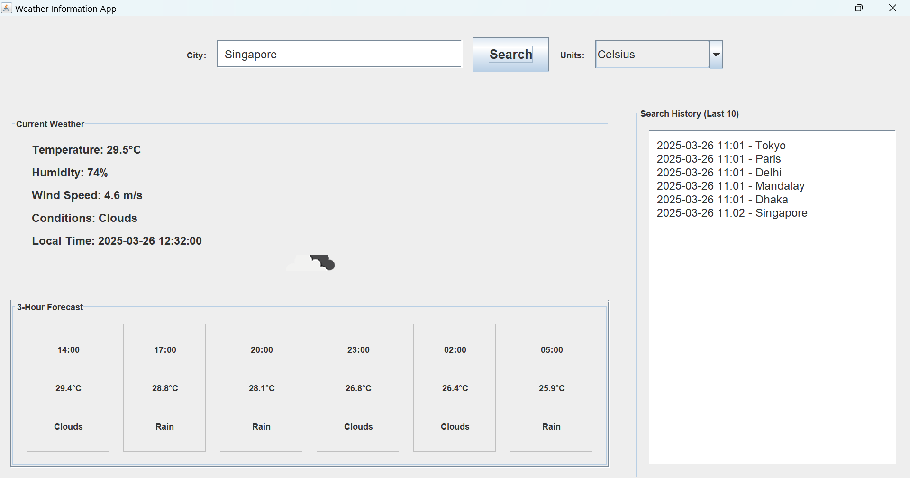

# Weather Information Application


A Java Swing application that provides real-time weather information and forecasts using OpenWeatherMap API.

## Features
- Current weather conditions for any city
- 18-hour forecast in 3-hour increments
- Temperature unit conversion (Celsius/Fahrenheit)
- Search history tracking
- Automatic timezone detection
- Error handling and retry mechanisms

## Prerequisites
- Java JDK 11+
- Internet connection
- JSON library (org.json)
- OpenWeatherMap API key (free tier)

## Setup Instructions

1. **Get API Key**
    - Register at [OpenWeatherMap](https://openweathermap.org/api)
    - Replace `API_KEY` in source code with your actual key
        

2. **Install Dependencies**
    - Download JSON library (version 20231013)
    - Add to classpath: `json-20231013.jar`

3. **Compilation**
   ```bash
   javac -cp .;json-20231013.jar WeatherApp.java
   
4. **Execution**
    ```bash
   java -cp .;json-20231013.jar WeatherApp
   
## Usage Guide
**Search Weather**
* Enter city name in text field
* Click Search button or press Enter

**Switch Units**

* Use dropdown to select Celsius/Fahrenheit
* Automatic conversion without re-fetching

**View History**

* Last 10 searches shown in right panel
* Timestamped entries with local time

**Forecast Navigation**

* Scroll horizontally to view full forecast
* Hover over entries for detailed view

# Implementation Details

### Architecture
* MVC pattern implementation
* SwingWorker for background API calls
* Custom data models for weather data
* Separated UI and business logic

### Key Components

* WeatherData: Model for current weather
* ForecastData: Model for forecast entries
* API Manager with retry logic
* Unit conversion utilities
* History manager with FIFO buffer

### Error Handling

* Connection timeouts (10s)
* API error responses
* Invalid city names
* Network failure retries
* Malformed URL prevention

### Troubleshooting

| Issue            | Solution                                      |
|-------------------|----------------------------------------------|
| API Errors        | Verify API key and internet connection       |
| No Results        | Check city spelling and try major cities     |
| Missing Icons     | Ensure internet connection works             |
| Library Errors    | Verify JSON JAR in classpath                 |
| UI Glitches       | Restart application                          |


# Acknowledgments

* Weather data from OpenWeatherMap
* JSON library for Java (org.json)
* Oracle Java Documentation


# Screenshot



